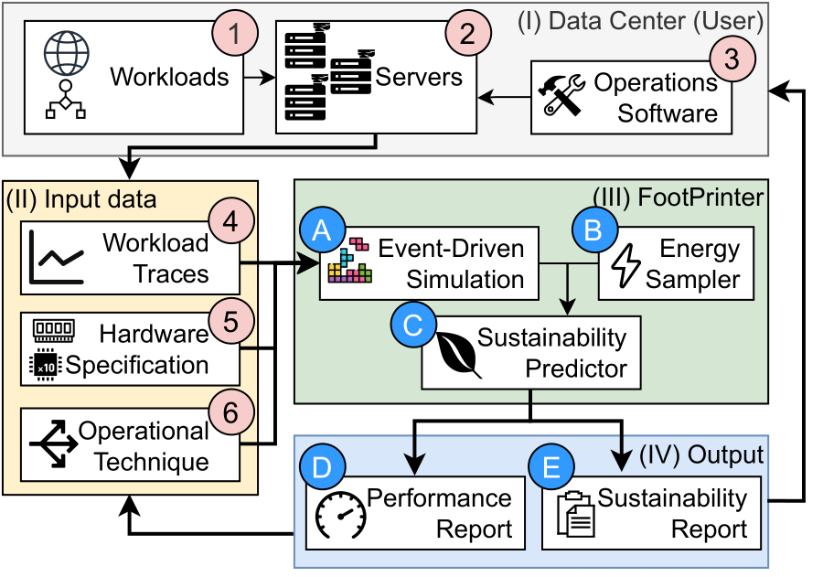

-----

# FootPrinter
This repository is the home to the source code of the FootPrinter framework, a first-of-its-kind simulation tool supports data center designers and operators assessing the environmental impact of their data center. 

FootPrinter replays provided workloads on hardware chosen by the user. FootPrinter is based on [OpenDC](https://opendc.org/), an data center discrete simulator.

## Architecture

The figure above shows the architecture of FootPrinter and illustrates how it could be used by data center operators. Using the FootPrinter starts at the real data center **I**. Over time, different workloads **1** are submitted to the servers 2 , and the operations software **3** is used to decide when, where, and how these workloads are executed. The activity of the data center is monitored during operations and recorded. To use FootPrinter, three pieces of information are

required as input data **II** :
- **4** Workload traces that describe when jobs are submitted and hardware requirements of each job. The trace also describes the computational demand over time. FootPrinter is designed to work with traces of any sample frequency. However, providing traces with higher frequency will result in more precise results.

- **5** Hardware and environment specifications that describe the hardware used by the datacenter. To determine the carbon footprint, it is also important to define where a data center is located.

- **6** Operational techniques that define how and when jobs are run. Important factors are the scheduling and resource allocation policies.

The input data is sent to the FootPrinter to replay. The FootPrinter architecture **III** consist of the following components:
- **A** The Event-Driven Simulator replays the given workload traces on the given data center configuration. During the run, the simulator is sampled for performance metrics and energy usage. The frequency of sampling can be chosen to best fit the current experiment. Higher frequency will result in more precision at a cost of increasing the simulation time.

- **B** The Energy Sampler determines the carbon intensity of the grid while the simulation is run. Whenever the event-driven simulator is sampled, the carbon intensity of the grid is needed. The energy mix of the grid is sampled using the Python API7 of the [ENTSO-E](https://github.com/EnergieID/entsoe-py) Transparency Platform.

- **C** The Sustainability Predictor aggregates the results of the simulation into sustainability metrics, such as the total carbon emitted and the carbon emission over time. These metrics can be used to determine the operational carbon footprint of the data center during the workload.

FootPrinter generates two types of output **IV** . First, the Performance Report **D** shows the performance of the data center during the provided workload. Examples of performance metrics are the time of completion, or average CPU utilization. Next to the performance of the data center, a sustainability report **E** is made. Examples of sustainability metrics are the energy usage, or the carbon emitted. Designing data centers is a difficult process, in which often improvements in sustainability are connected to decreases in performance. FootPrinter reports both sides to provide the data center operators with a complete insight

## How to use

This repository provides all files to run and analyse a workload using FootPrinter. [footprinter.py](footprinter.py) shows a simple example on how to get results similar to those shown in the paper.